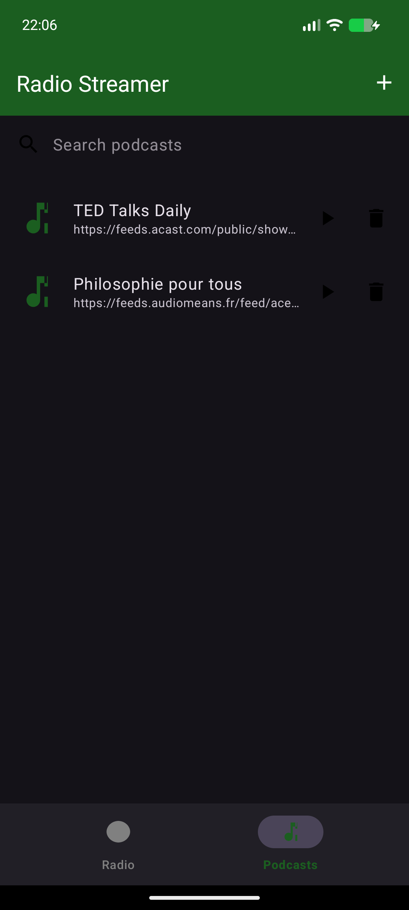

[](https://www.buymeacoffee.com/adegard)

# Radio Streamer (and podcats)

A simple, ad-free internet radio app for Android. Stream any radio station or podcast rss feed from the web, keep listening with the screen off, and manage your own station list.

[](https://github.com/adegard/RadioStreamer/actions/workflows/build.yml)



## Features

- 📻 **Internet radio streaming** powered by ExoPlayer / Media3 (supports MP3, AAC, HLS/m3u8, http and https streams)
- 🎙️ **Podcasts** — subscribe by RSS feed, search the iTunes/Apple Podcasts catalog, paste any podcast/web page URL, browse episodes and play them
- 🌙 **Background playback** — audio keeps playing with the screen off, with lock-screen and notification controls
- ➕ **Add your own content** — radio stations and podcasts via the `+` button
- 🗑️ **Delete stations & podcasts** — tap the trash icon on any row
- 💾 **Reinstall-proof lists** — your stations and podcasts are backed up to `Download/RadioStreamer/` and restored after a reinstall
- 🔍 **Podcast search** — filter your library, or search the Apple Podcasts catalog when adding
- 🚫 No ads, no tracking

## How podcast search works

Tap the `+` button on the Podcasts tab and type either:
- a podcast name (e.g. "BBC Global News") → searched on the Apple Podcasts catalog
- an RSS feed URL → fetched directly
- a podcast web page URL → the app tries to auto-discover the RSS feed

Radio France "exclusive" shows (like the Foucault series, available only in their own app) have no public RSS feed, so they can't be subscribed this way; most other podcasts publish an RSS feed.

## Default stations

The app ships with 22 well-known stations (including BBC World Service, Radio Paradise, and France Info) and a fresh Podcasts tab where you can subscribe to any RSS feed or search the Apple Podcasts catalog.

## Install

Download `RadioStreamer-debug.apk` (or the signed `-release.apk`) from the [latest release](../../releases/latest) or from any successful [Actions run](../../actions) artifact, then install it on your phone. You may need to allow "install unknown apps" for your browser/file manager.

## Build it yourself

```bash
./gradlew :app:assembleDebug     # debug APK
./gradlew :app:assembleRelease   # signed release APK
```

APKs end up in `app/build/outputs/apk/<variant>/`. Requires JDK 17 and an Android SDK (API 34).

Pushing a tag like `v1.2` makes GitHub Actions build signed APKs and publish them as a GitHub Release automatically.

## Tech

Kotlin · AndroidX Media3 (ExoPlayer + MediaSessionService foreground service) · Material 3 · Kotlin Coroutines · RSS + iTunes Search API · minSdk 24 / targetSdk 34

---

For an overview of all my other projects, see https://adegard.github.io/blog/
